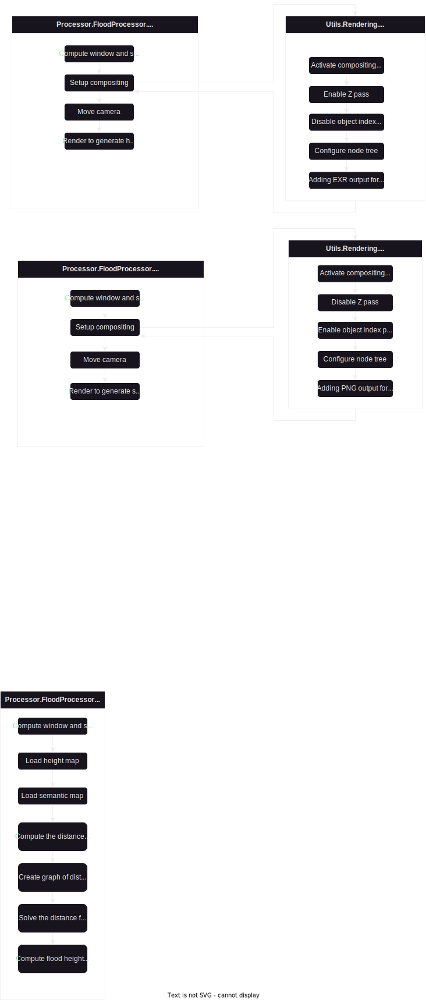
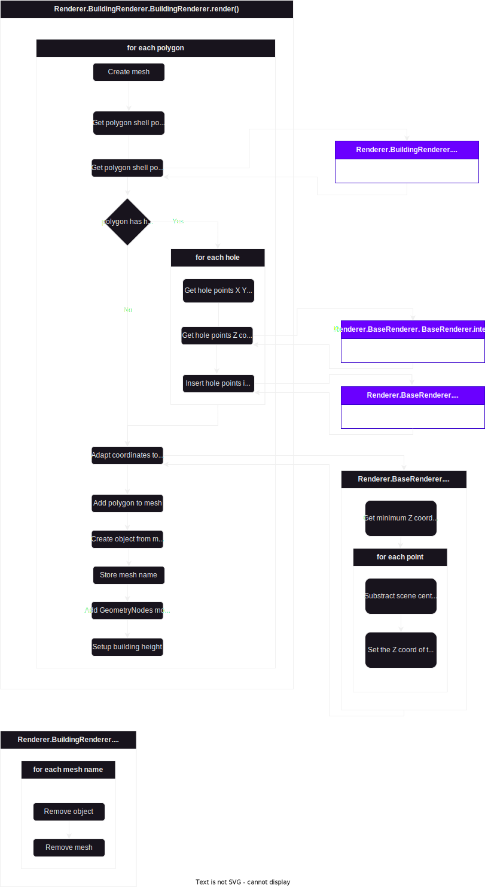
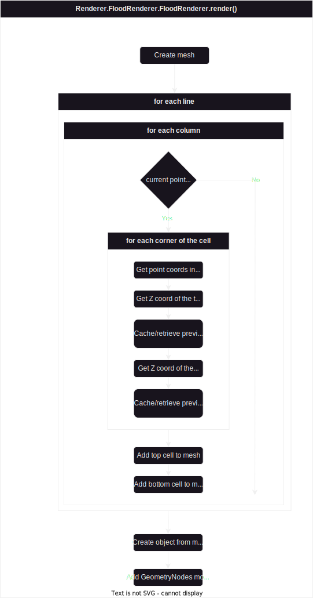

# MAGE Procgen Dev Documention 

This page is desgined to help you edit, customize and improve this software.
It will describe the internal modules, their roles and interactions.

## Structure

The project is divided into a few folders:

  * Assets: Stores the blender assets for rendering.
  * Config: Stores the default configuration files.
  * Loader: Python module. Used to load all files that the software might need using
  * Manager: Python module. High-level objects that handle a particular job.
  * Parser: Python module. Low-level objects that parse files
  * Processor: Python module. Objects that are used for processing and calculations
  * Renderer: Python module. Objects that directly interact with Blender's API to display the objects.
  * Utils: Python module. Dataclasses, utilities, constants ...
  * main.py: the main python file

## Deprecated Elements [TODO]
    
LOREM IPSUM DOLOR SIT AMET

## Lighting

The scene is lit using a [native Blender Add-on](https://docs.blender.org/manual/en/3.5/addons/lighting/sun_position.html).

Currently, the sun position is set to the current date, at 12PM, located at the center of the scene, but it could be customized.

Likewise, the intensity of the light is fixed for now, but could be ajusted.

## Schemas

### Main

### FloodProcessor

### RenderManager

### Beautify

### BaseRenderer

### RoadRenderer

### BuildingRenderer

### FloodRenderer

